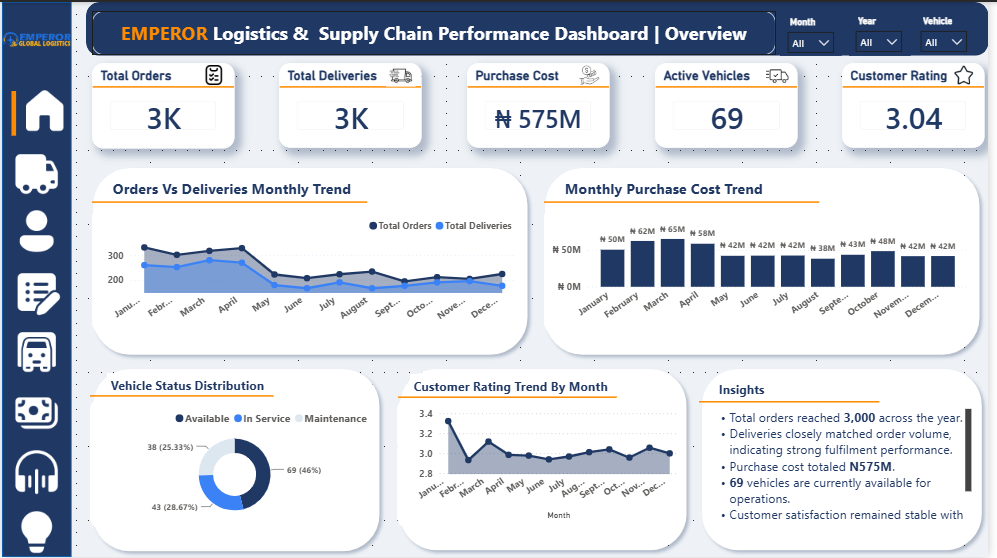
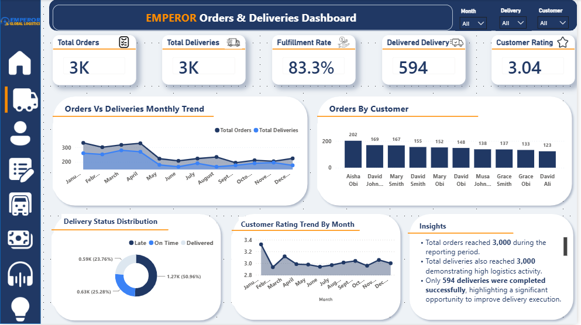
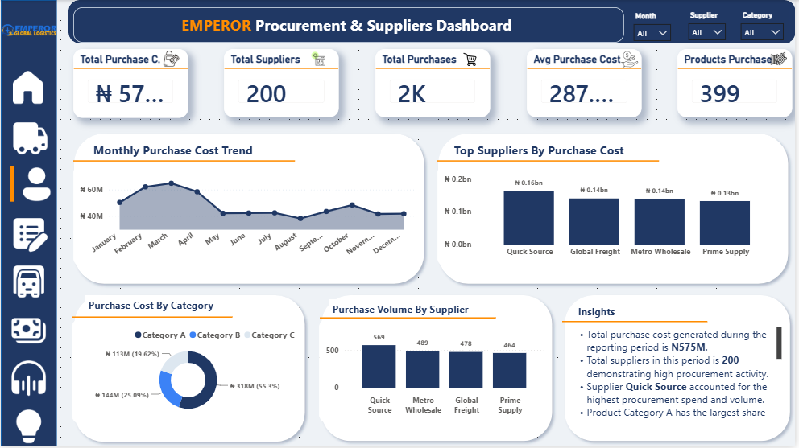
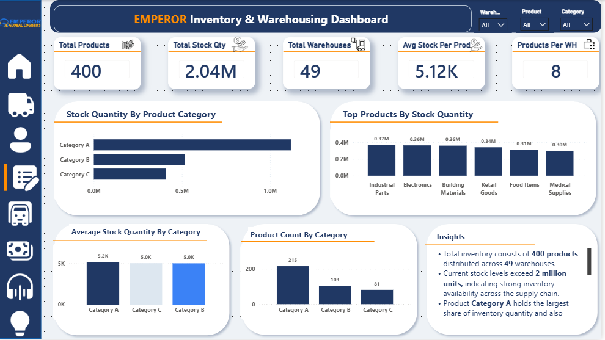
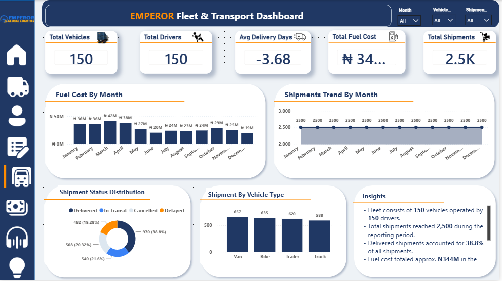
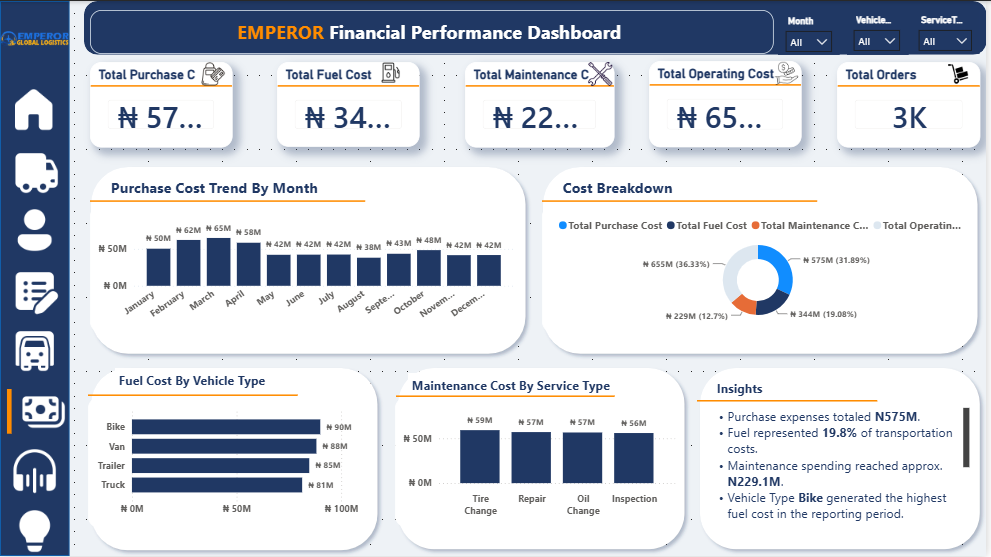
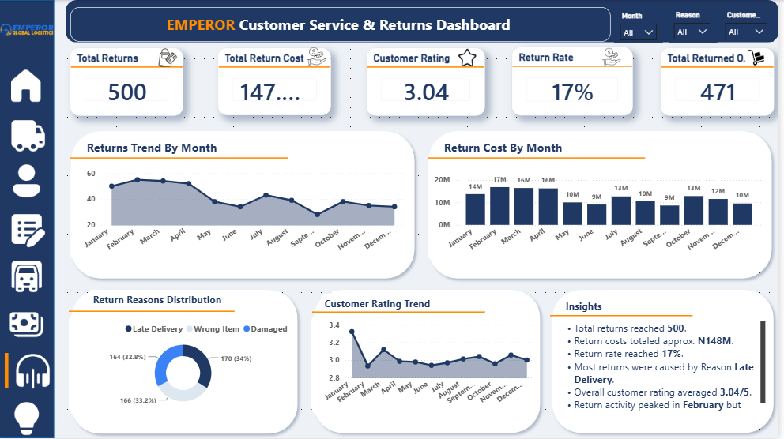
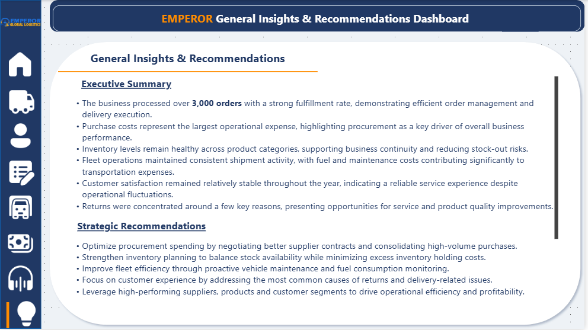

# 🚚 Emperor Logistics & Supply Chain Performance Analytics

An end-to-end Business Intelligence solution built in Power BI for a logistics and supply chain company, featuring interactive dashboards across executive reporting, orders & deliveries, procurement, inventory, fleet operations, finance, customer service, returns, and strategic recommendations.

---

## 📸 Project Snapshot

| Metric | Value |
|--------|------:|
| 📦 Total Orders | **3,000** |
| 🚚 Total Deliveries | **3,000** |
| 💰 Purchase Cost | **₦575M** |
| 🚛 Active Vehicles | **69** |
| ⭐ Customer Rating | **3.04** |
| 📊 Dashboards | **8** |

---

## 📌 Project Overview

This project presents a comprehensive **Supply Chain and Logistics Analytics Dashboard** developed for **Emperor Logistics** using **Power BI**.

The objective was to analyze key business functions across logistics and supply chain operations, providing management with actionable insights into order fulfillment, procurement spending, inventory availability, fleet performance, transportation costs, customer returns, and overall operational efficiency.

The solution was designed to transform raw logistics data into KPI-driven dashboards that improve visibility across the company’s operations and support data-driven decision-making.

---

## 🎯 Business Problem

Emperor Logistics operates across multiple supply chain functions including order fulfillment, procurement, warehousing, transportation, fleet operations, and customer service. Without a centralized analytics solution, it becomes difficult for management to monitor performance across these interconnected business areas, identify cost drivers, track service quality, and make timely strategic decisions.

The business required a unified reporting solution to:

- Monitor logistics and supply chain performance in one place
- Track order fulfillment and delivery trends
- Analyze procurement spending and supplier activity
- Evaluate inventory availability across warehouses
- Assess fleet utilization, shipment activity, and transport costs
- Review customer service performance and return patterns
- Generate actionable business insights and strategic recommendations

---

## 🎯 Project Objectives

- Monitor overall logistics and supply chain performance
- Analyze order and delivery trends across time
- Evaluate procurement costs and supplier-related spending
- Assess inventory and warehouse activity
- Track fleet utilization, shipment status, and transport cost patterns
- Review financial performance across logistics operations
- Analyze customer service performance, return reasons, and return costs
- Deliver strategic insights and recommendations for operational improvement

---

## 🛠️ Tools & Technologies

- Power BI
- Power Query
- DAX
- Microsoft Excel

---

## 📂 Dataset

The project was built using logistics and supply chain business data covering:

- Customers
- Suppliers
- Products
- Warehouses
- Vehicles
- Drivers
- Employees
- Orders
- Shipments
- Deliveries
- Inventory
- Purchases
- Returns
- Fuel Logs
- Maintenance

---

## 📊 Dashboard Pages

1. Executive Overview  
2. Orders & Deliveries Analysis  
3. Procurement & Supplier Analysis  
4. Inventory & Warehousing Analysis  
5. Fleet & Transport Analysis  
6. Financial Performance Analysis  
7. Customer Service & Returns Analysis  
8. General Insights & Recommendations  

---

## 📈 Key Performance Indicators (KPIs)

The dashboard tracks a wide range of operational and financial KPIs, including:

- Total Orders
- Total Deliveries
- Fulfillment Rate
- Delivered Deliveries
- Purchase Cost
- Active Vehicles
- Customer Rating
- Total Suppliers
- Total Purchases
- Total Products
- Total Stock Quantity
- Total Warehouses
- Total Vehicles
- Total Drivers
- Fuel Cost
- Shipment Volume
- Maintenance Cost
- Operating Cost
- Return Count
- Return Cost
- Return Rate

---

## 💡 Business Value

This dashboard enables management to:

- Monitor logistics and supply chain performance at a glance
- Track order fulfillment and delivery efficiency
- Identify procurement cost patterns and key supplier spend drivers
- Evaluate inventory availability and warehouse distribution
- Assess fleet readiness, shipment activity, and transportation costs
- Monitor return patterns, customer satisfaction, and service quality
- Support data-driven operational planning and strategic decision-making

---

## 📷 Dashboard Preview

### 📊 Executive Overview
Provides a high-level snapshot of the company’s logistics and supply chain performance across orders, deliveries, procurement, fleet availability, and customer satisfaction.

---

### 🚚 Orders & Deliveries Analysis
Focuses on order fulfillment performance, delivery trends, fulfillment rate, customer activity, and delivery status distribution.

---

### 🧾 Procurement & Supplier Analysis
Analyzes purchase cost trends, supplier contribution, category-level procurement spending, and purchase volume by supplier.

---

### 📦 Inventory & Warehousing Analysis
Provides visibility into stock quantity, warehouse coverage, top stocked products, and inventory distribution by product category.

---

### 🚛 Fleet & Transport Analysis
Tracks fleet size, shipment activity, vehicle utilization, shipment status, fuel cost trends, and delivery transport performance.

---

### 💰 Financial Performance Analysis
Examines key logistics cost drivers including purchase cost, fuel cost, maintenance cost, operating cost, and cost distribution across the business.

---

### 📞 Customer Service & Returns Analysis
Monitors return trends, return cost, return reasons, customer satisfaction, and service issues affecting delivery and product experience.

---

### 💡 General Insights & Recommendations
Summarizes key findings from the full dashboard suite and presents strategic recommendations to improve procurement efficiency, fleet performance, inventory planning, customer experience, and overall supply chain effectiveness.

---

## 🔍 Key Insights

### Executive Overview
- Total orders and deliveries both reached **3,000**, indicating strong logistics activity across the reporting period.
- Purchase cost totaled **₦575M**, making procurement one of the most significant operational cost drivers.
- **69 active vehicles** were available to support ongoing transport operations.
- Customer satisfaction remained relatively stable with an average rating of **3.04**.

### Orders & Deliveries
- Total deliveries matched order volume at **3,000**, showing a strong throughput level.
- Fulfillment rate stood at **83.3%**, suggesting there is still room to improve successful delivery completion.
- Only **594 deliveries** were fully completed successfully, highlighting operational gaps in final delivery execution.

### Procurement & Suppliers
- Procurement spending reached **₦575M** across the reporting period.
- **200 suppliers** supported procurement operations, showing a broad supplier base.
- Supplier **Quick Source** recorded the highest procurement spend and purchase volume.
- **Category A** accounted for the largest share of purchase cost.

### Inventory & Warehousing
- Inventory operations covered **400 products** distributed across **49 warehouses**.
- Total stock levels exceeded **2 million units**, indicating strong stock availability.
- **Category A** held the highest inventory quantity and product count.

### Fleet & Transport
- The business operated with **150 vehicles** and **150 drivers**.
- Shipment volume reached **2,500**, showing high transport activity.
- Fuel cost totaled approximately **₦344M**, making transport one of the major logistics cost areas.
- Vans recorded the highest shipment volume among vehicle types.

### Financial Performance
- Purchase cost, fuel cost, maintenance cost, and operating cost represented the major cost components of logistics operations.
- Fuel cost accounted for a significant share of total transportation spending.
- Maintenance spending exceeded **₦229M**, highlighting the importance of vehicle servicing and upkeep.

### Customer Service & Returns
- Total returns reached **500** with a return rate of **17%**.
- Return cost totaled approximately **₦148M**.
- **Late Delivery** emerged as the leading return reason, followed by wrong item and damaged item issues.
- Customer satisfaction remained moderate at **3.04/5**, suggesting room for service quality improvement.

---

## 🚀 Strategic Recommendations

Based on the dashboard findings, the following actions are recommended:

- **Improve delivery execution** by investigating failed or incomplete deliveries and addressing operational bottlenecks in last-mile fulfillment.
- **Optimize procurement spend** by negotiating better terms with top suppliers and consolidating high-volume purchasing where appropriate.
- **Strengthen inventory planning** to maintain stock availability while reducing overstock risk and improving warehouse allocation efficiency.
- **Reduce transport costs** through better fuel consumption monitoring, route optimization, and proactive fleet maintenance scheduling.
- **Address return drivers** by focusing on late delivery issues, wrong-item fulfillment, and product handling quality.
- **Enhance customer experience** by improving service responsiveness and monitoring customer satisfaction trends more closely.
- **Monitor high-cost operational areas** such as procurement, fuel, and maintenance through regular performance reviews and cost-control reporting.

---

## 🚀 Future Improvements

Future versions of this project may include:

- Delivery performance forecasting
- Fleet maintenance trend analysis
- Procurement cost forecasting
- Inventory demand forecasting
- Warehouse optimization metrics
- Real-time logistics performance monitoring

---

## 💼 Skills Demonstrated

- Data Cleaning
- Data Modeling
- Power Query
- DAX Calculations
- KPI Development
- Dashboard Design
- Logistics & Supply Chain Analysis
- Financial Performance Analysis
- Data Visualization
- Executive Reporting
- Business Insight Generation
- Data Storytelling

---

## 📌 Key Takeaways

This project demonstrates my ability to transform complex logistics and supply chain data into actionable business intelligence through KPI-driven dashboards and executive reporting. It highlights my skills in data cleaning, data modeling, DAX calculations, dashboard design, and translating operational data into insights that support cost control, service improvement, and strategic decision-making.

---

## 👩🏽‍💻 Author

**Adaku Bridget Nwaolisa**

Aspiring Data Analyst passionate about transforming data into actionable business insights.
